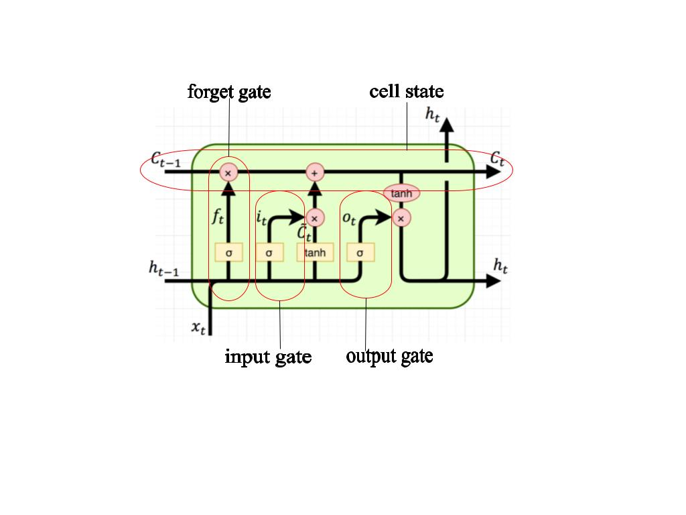
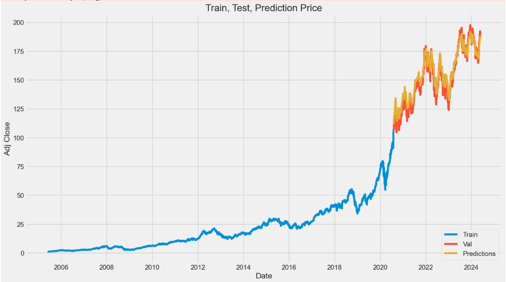
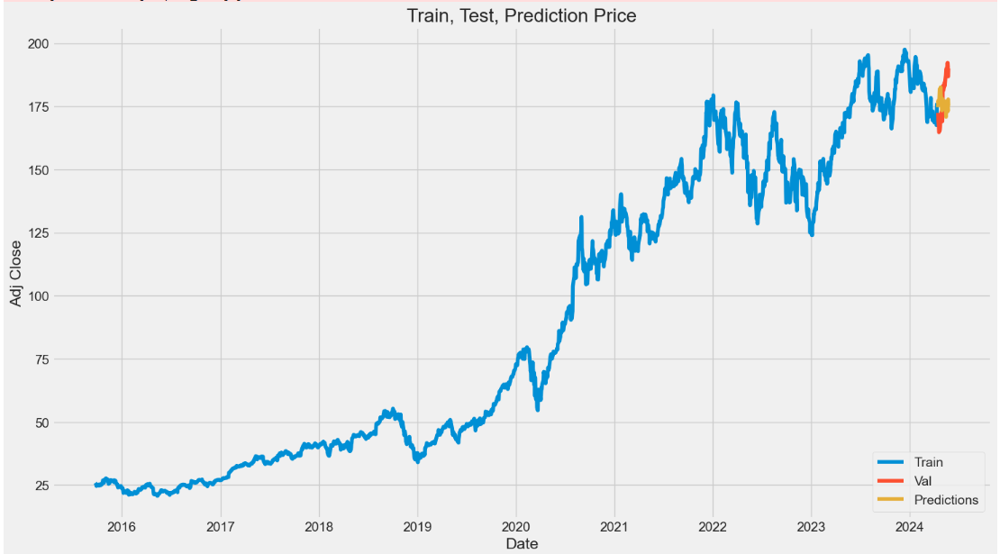

# Machine-Learning

## Information
- Student: Bùi Thế Trung - 21110108 - 21110108@st.vju.ac.vn

## Problem Statement

- The stock market is volatile and depends on various external factors.
- In addition to external factors, the influence of past stock prices also significantly affects the future.
- Identifying this influence contributes to predicting future stock prices.

## Question

- Predict the stock price of Apple company for the next n days (n > 0) based on historical trading data.

## Solution

### Idea
- Learn about LSTM [here](https://dominhhai.github.io/vi/2017/10/what-is-lstm/).
- Use a Long Short-Term Memory (LSTM) network to analyze the relationship between the past and the future.
- Reasons for using LSTM:
  - LSTM and RNN, in general, are designed to handle sequential data.
  - Each neuron in the LSTM network has three gates and a cell state.
  
  
    - `cell state`: This is where a cell can store information (partly related to information processed earlier, partly related to the input data at each cell).
    - `forget gate`: Decides what information should be discarded or kept (input to this gate includes input data and information from the previous cell).
    - `input gate`: Filters important information from the input data and the previous cell's information, updating this information into the `cell state`.
    - `output gate`: Decides the input for the next cell by further filtering information from `input, cell state, and information received from the previous cell`.

### Execution

- Data Collection
  - Use the `DataReader` library from `Pandas`.
  - Install: `pip install pandas-datareader`.

- Data Preprocessing
  - Keep only the `Adj Close Price` column for prediction.
  - Scale the data using `sklearn.preprocessing.MinMaxScaler`.
  - Transform the data into a format that LSTM can read (data in 3D format).
    - `sequence`: Total input data.
    - `time_step`: Number of input data needed for one prediction.
    - `feature`: Number of data samples for one output (calculated from the `time_step` input data above).

- Build Model
  - Use `LSTM` from the `keras` library (install: `pip install Keras`).
  - The model consists of one LSTM layer.
    - For predicting one day
      - `time_step = 60`: Use the past 60 days for input data for one prediction.
      - `feature = 1`: Output data is the price of the next day.
    - For predicting 30 days
      - `time_step = 1500`: Use the past 1500 days for input data for one prediction.
      - `feature = 30`: Output data is the stock price for the next 30 days.

- Prediction
  - For predicting one day: the test set contains 2122 values.
  - For predicting 30 days: the test set contains 30 values (if more, handling overlapping predictions is required).

## Demo
  - Predicting the stock price for the next 1 day (test set includes 2122 values): `MSE = 26.652150430735873`
  
  - Predicting the stock price for the next 30 days (test set includes 30 values): `MSE = 16.084394047657305`
  
